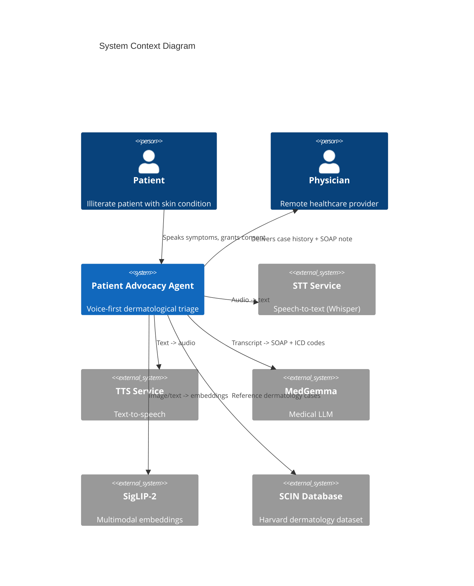
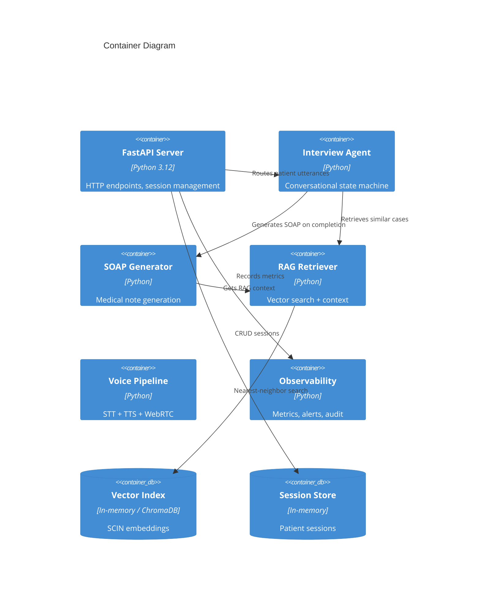

# Architecture Overview

**Patient Advocacy Agent — System Architecture**

## 1. Context

The Patient Advocacy Agent is a voice-first dermatological triage system
designed for underserved communities in the Global South. It serves
illiterate patients who interact entirely via voice, and delivers
structured case histories to remote physicians.

### C4 Context Diagram



### C4 Container Diagram



## 2. Key Design Decisions

| Decision | Rationale |
|---|---|
| Voice-only interface | Target users are illiterate; no text UI needed |
| Mock-first development | All external services (MedGemma, SigLIP-2, STT, TTS) have mock implementations for testing without GPU |
| In-memory vector index | ChromaDB planned for production; in-memory sufficient for development |
| Protocol-based interfaces | Runtime-checkable Protocol classes enable swap between mock and real implementations |
| Session state machine | Clear stage transitions (greeting -> interview -> consent -> image -> analysis) |
| Always-on disclaimer | Every output includes "not a doctor" disclaimer per medical AI safety |
| Escalation keywords | Hard-coded keyword matching for immediate physician referral |

## 3. Data Flow

```
Patient speaks
    -> STT (Whisper) -> text
    -> Language detection -> detected language
    -> Interview Agent (state machine)
        -> [greeting] -> set language, advance to interview
        -> [interview] -> MedGemma generates follow-up
            -> After 3+ turns, request image consent
        -> [consent] -> yes/no -> grant or skip
        -> [image capture] -> camera -> SigLIP-2 embedding
    -> RAG retrieval (text/image -> vector search -> similar SCIN cases)
    -> SOAP generation (transcript + RAG context + image -> MedGemma)
    -> Case history formatting (CASE-{id}, SOAP, ICD codes, escalation)
    -> Patient explanation (simple TTS output)
    -> Physician report delivery
```

## 4. Technology Stack

| Layer | Technology | Purpose |
|---|---|---|
| Web framework | FastAPI | Async HTTP API |
| Configuration | pydantic-settings + YAML | Layered config |
| Logging | structlog (JSON) | Structured logging |
| Embedding | SigLIP-2 (mock) | Image/text embeddings |
| Medical LLM | MedGemma (mock) | SOAP generation |
| Voice | Whisper + TTS (mock) | Speech processing |
| Vector store | In-memory (ChromaDB planned) | Nearest-neighbor search |
| Testing | pytest + pytest-asyncio | Unit/integration/safety tests |
| CI/CD | GitHub Actions | Automated pipeline |
| Container | Docker | Deployment |
| Linting | ruff + mypy | Code quality |

## 5. Security

- PII/PHI redaction on all logged data
- Non-root Docker container
- Secret key validation in production
- CORS middleware with configurable origins
- No prescription language in any output
- Consent-gated image capture
